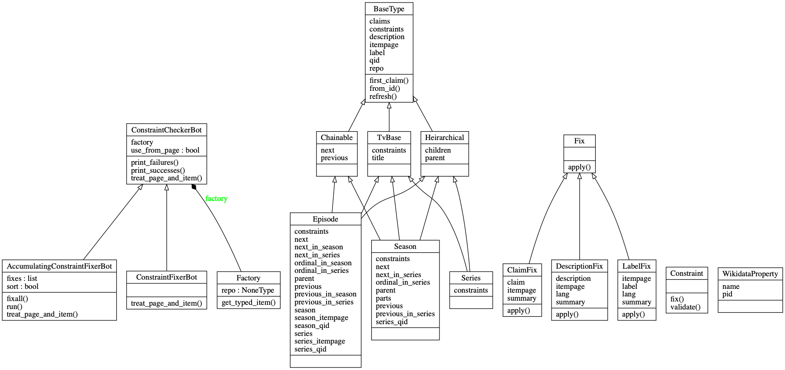

# The Wikidata Toolkit

 [](https://opensource.org/licenses/MIT)

A Python project with WikiBot implementations to fix consistency issues on Wikidata.

## Table of Contents

1. [Introduction](#introduction)
1. [Why Television Series?](#why-television-series)
1. [Design](#design)
1. [Usage](#usage)
    1. [Pre-Requisites](#pre-requisites)
    1. [Sample Commands](#sample-commands)
    1. [Canned Scripts](#canned-scripts)
1. [Constraints](#constraints)

## Introduction

This repo contains a few utility scripts that fix consistency issues and missing data on [Wikidata](https://www.wikidata.org), focusing on TV series.

It is used by my Wikidata bot a.k.a. [TheFireBenderBot](https://www.wikidata.org/wiki/User:TheFireBenderBot). Check out its [contributions](https://www.wikidata.org/wiki/Special:Contributions/TheFireBenderBot) to get an idea of what it specializes at. Here are some [stats](https://xtools.wmflabs.org/ec/www.wikidata.org/TheFireBenderBot).

## Why Television Series?

As part of working with the OMDB API, I discovered gaps in the results such as missing episodes. [Some replies](https://github.com/omdbapi/OMDb-API/issues/88#issuecomment-413684586) on the issues revealed that they use Wikidata as a backend, which led me to explore Wikidata itself.

In the future, this repo may evolve to encompass more cultural genres such as movies and books.

In general, Wikidata is an incredibly useful open-source data source, and any contribution to the service can have a large, positive impact on all downstream users, including academic projects and research.

## Design



[`constraint.py`](./constraints/api.py) contains the abstract definition for the concept of a _Constraint_. This is similar to how Wikidata defines constraints, except that the implementation may contain a way to fix them.

[`general.py`](./constraints/general.py) and [`tv.py`](./constraints/tv.py) contain a few concrete implementations for constraints.

[`bots`](./bots) contains various Bot implementations that can be used to iterate through Wikidata pages using a generator, and _treat_ (process) them.

[`television.py`](./model/television.py) contains abstract models for the concepts of Episode, Season, Series and more. Each model has some semantic knowledge of the item it encapsulates, as well as the constraints it should be checked for.

[`wikidata_properties.py`](./properties/wikidata_properties.py) has a bunch of constants that encode property codes and a few common ID values. A list of all properties can be found [here](https://www.wikidata.org/wiki/Wikidata:List_of_properties/all_in_one_table)

## Usage

### Pre-Requisites

#### Account Setup

In order to run the scripts, you need to [create a Bot account](https://www.wikidata.org/wiki/Wikidata:Creating_a_bot) on Wikidata. Bot names usually end with the suffix "Bot". Once you have the appropriate credentials, create the following files:

[`user-config.py`](https://www.mediawiki.org/wiki/Manual:Pywikibot/user-config.py)

```python
family = 'wikidata'
mylang = 'wikidata'

usernames['wikidata']['wikidata'] = u'YourBotName'
password_file = "user-password.py"
```

[`user-password.py`](https://www.mediawiki.org/wiki/Manual:Pywikibot/BotPasswords)

```python
(u'YourBotName', BotPassword(u'YourBotName', u'YourBotPassword'))
```

OR

```python
(u'YourUserName@YourBotName', u'YourBotPassword')
```

Also see the [Wikidata page on Bots](https://www.wikidata.org/wiki/Wikidata:Bots)

#### Requirements

Next, you need to install dependencies using the `requirements.txt` file. This is best done using a virtualenv and pip3:

```bash
virtualenv pywiki
source pywiki/bin/activate
pip3 install -r requirements.txt
```

### Sample Commands

1. Checking individual items for constraint failures:
    ```bash
    # Q65604139 = Season 1 of "Dark"
    # Q65640227 Q65640226 Q65640224 = Episodes of "Dark"
    python3 check_constraints.py Q65640227 Q65640226 Q65640224 Q65604139
    ```
1. Checking the episodes of a series (Jessica Jones) for constraint failures:
    ```bash
    # Q18605540 = Jessica Jones
    python3 check_tv_show.py Q18605540 \
        --child_type=episode
    ```
1. Checking and fixing the seasons of a series for constraint failures
    ```bash
    # Q18605540 = Jessica Jones
    python3 check_tv_show.py Q18605540 \
        --child_type=season \
        --autofix
    ```
1. Checking and fixing the episodes of a series for constraint failures, but wait until all the failures have been reported before fixing all of them at the end.
    ```bash
    # Q18605540 = Jessica Jones
    python3 check_tv_show.py Q18605540 \
        --child_type=episode \
        --autofix \
        --accumulate
    ```
1. Fixing only the titles of episodes of a series
    ```bash
    # Q18605540 = Jessica Jones
    python3 check_tv_show.py Q18605540 \
        --child_type=episode \
        --autofix \
        --accumulate \
        --filter title
    ```
    An equivalent command is
    ```bash
    # Q18605540 = Jessica Jones
    python3 check_tv_show.py Q18605540 \
        --child_type=episode \
        --autofix \
        --accumulate \
        --filter P1476
    ```

### Canned Scripts

A few fixes are fairly straightforward, and should not require supervision. The [`canned`](./canned) folder exposes these fixes in the form of scripts that can be run directly without any arguments. If you want to see what changes will be made, run the script with the `--dry` flag.

Example:
```bash
# Dry run mode, won't update labels
python3 -m canned.fix_missing_labels --dry

# Run after confirming that the changes look correct
python3 -m canned.fix_missing_labels
```

## Constraints

| Constraint Name | Description | Supports Autofix | Example | Relevant Properties |
|-----------------|-------------|------------------|---------|----|
| [has_property](./constraints/general.py#L13)    | Check if an item has a certain property | No | An episode should have the property 'title' (P1476) | |
| [inherits_property](./constraints/general.py#L22) | Check if an item inherits a certain property from its parent | Yes | An episode should have the same value for 'country of origin' (P495) as its season | |
| [follows_something](./constraints/general.py#L59) | Check if an item follows another item | Yes | An episode (S1 E9) must follow the episode (S1 E8) | P155 (follows) |
| [is_followed_by_something](./constraints/general.py#L80) | Check if an item is followed by another item | Yes | An episode (S1 E8) must be followed by the episode (S1 E9) | P156 (followed by) |
| [season_has_no_of_episodes_as_count_of_parts](./constraints/tv.py#L14) | Check if a season has its 'no of episodes' (P1113) set to the number of parts | No | If a season (S1) has 8 values in its 'has part' field, it should have 8 as its 'no of episodes' field | P527 (has part), P1113 (no of episodes) |
| [season_has_parts](./constraints/tv.py#L26) | Check if a season has its episodes listed as its parts | Yes | A season with 10 episodes (S1 E1 to S1 E10) must have all 10 episodes in its 'has part' property | P527 (has part) |
| [has_title](./constraints/tv.py#L48) | Check if an episode/season has its 'title' (P1476) set | Yes | An episode whose title is "Beginnings" must have the property set to this value | P1476 (title) |
| [has_english_label](./constraints/tv.py#L84) | Check if an episode/season has its 'label' set | Yes | An episode whose title is "Beginnings" must have the label set to this value | label |
| [episode_has_english_description]() | Check if an episode has its 'description' set | Yes | The third episode from "Dark"'s second season has a description like _episode of Dark (S2 E3)_ | description |
| [series_has_no_of_episodes]() | Check if a series has the total number of episodes set | Yes :construction: | A series with 84 episodes should have _84_ set for _number of episodes_ | P1113 (number of episodes) |
